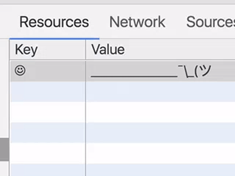

# Cycle animated localStorage driver

A [Cycle.js](http://cycle.js.org) [driver](http://cycle.js.org/drivers.html) for animating (srsly) [localStorage](https://developer.mozilla.org/en-US/docs/Web/API/Window/localStorage).

```
npm install --save cyclejs-animated-localstorage
```



## Usage

```js
import { Observable } from 'rx';
import { run } from '@cycle/core';
import makeAnimatedLocalStorageDriver from 'cyclejs-animated-localstorage';

function main() {
  const text$ = Observable.just('¯\\_(ツ)_/¯');

  return {
    animatedText: text$,
  };
}

const drivers = {
  animatedText: makeAnimatedLocalStorageDriver(),
};

run(main, drivers);
```

## Configuration

The `makeAnimatedLocalStorageDriver` function takes one parameter - the `options` object.

Available options include:

- `interval` (Number): how often (ms) should the value be updated. Default: `100`.
- `size` (Number): the width (in characters) of the text. Default: `20`.
- `placeholder` (String): the character to fill blank space with. Default: `'_'`.
- `key` (String): the localStorage key. Default: `'☺'`.
